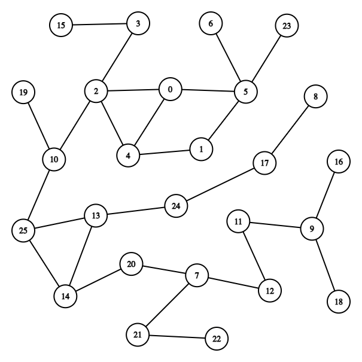

# SDR 2022 / Labo 4 - Paradigmes

> Nicolas Crausaz & Maxime Scharwath

Le labo est composé de 2 parties qui permettent chacune de compter de façon distribuée le nombre
d’occurrences de lettres dans un texte. Chaque nœud du réseau est responsable du comptage des
occurrences d’une lettre. Le réseau physique interconnecte tous les nœuds, mais les algorithmes
distribués utilisent uniquement un réseau logique dont la topologie est un graphe quelconque (pas
forcément une arborescence). Pour la première partie, on utilisera un algorithme synchrone
(ondulatoire) et pour la deuxième partie, un algorithme asynchrone (sondes et échos).

## Configuration

La configuration des serveurs se trouve dans le fichier [`config.json`](./config.json)

```json
{
  "servers": [ // Liste des serveurs avec leurs configurations
    { "host": "localhost", "port": 10000, "letter": "A", "neighbours": [1, 4] },
    { "host": "localhost", "port": 10001, "letter": "B", "neighbours": [0, 2] },
    { "host": "localhost", "port": 10002, "letter": "C", "neighbours": [1, 3, 4] },
    { "host": "localhost", "port": 10003, "letter": "D", "neighbours": [2, 4] },
    { "host": "localhost", "port": 10004, "letter": "E", "neighbours": [0, 2, 3] }
  ],
  "log": { // Configuration du logger
    "enabled": true, // Active ou désactive le logger
    "level": 0 // Niveau de log de 0 à 5 (0 = trace, 5 = fatal)
  }
}
```

Dans la configuration, les serveurs sont indicés de 0 à N-1. L'exemple ci-dessus est un petit graphe à 5 sommets 
que vous pouvez utiliser pour des tests. Il suffit de remplacer les serveurs dans la [configuration](./config.json) 
ou d'utiliser la copie de la configuration ([config-small-graph.json](./config-small-graph.json))

## Utilisation

### Visualisation

Nous avons généré un graphe à 26 sommets pour pouvoir compter toutes les lettres de l'alphabet. Voici sa représentation :


### Démarrer les serveurs

Dans la partie client, les serveurs sont indicés de 0 à N-1.
Il est possible de choisir le mode de démarrage des serveurs :
- 1 : Ondulatoire (défaut)
- 2 : Sondes et échos

Exemple:
```bash
// Démarrage du serveur 1 en mode Ondulatoire
$ go run server.go --id 1 --mode 1

// Démarrage du serveur 2 en mode Sondes et échos
$ go run server.go --id 2 --mode 2
```
Il est également possible et recommandé de démarrer directement tous les serveurs :

```bash
// Démarrage de tous les serveurs en mode Ondulatoire
$ go run servers.go --mode 1

// Démarrage de tous les serveurs en mode Sondes et échos
$ go run servers.go --mode 2
```


### Démarrer un client

Le client permet de compter le nombre d’occurrences de chaque lettre dans un texte.

Exemple:
```bash
// Démarrage du client pour le mode Ondulatoire
$ go run client.go --mode 1

// Démarrage du client pour le mode Sondes et échos
$ go run client.go --mode 2
```

En mode Ondulatoire (1), le client pourra demander le résultat à un nœud quelconque.
En mode Sondes et Echos (2), le résultat sera envoyé en réponse à la fin de l'algorithme par le serveur initial.

## Scenarios de tests

### Client

- Entrer une chaine vide comme mot : non accepté, erreur reportée à l'utilisateur
- Entrer des caractères non comptés par les serveurs (A à Z) : accepté, pas d'erreur, mais ces caractères ne seront pas comptabilisés par l'algorithme.
- Numéro de serveur invalide (`< 0` ou `> 25` (selon configuration)): non accepté, erreur reportée à l'utilisateur

### Algorithme Ondulatoire

#### Démarrage d'un seul serveur fonctionnel

```
$ go run server.go --id 1 --mode 1
```

**TEST OK**

---

#### Démarrage de tous les serveurs fonctionnel

```
$ go run servers.go --mode 1
```

**TEST OK**

---

#### Fonctionnel avec tous les serveurs

_mot = abcdefghijklmnopqrstuvwxyz_

Démarrage de tous les serveurs
```
$ go run servers.go --mode 1
```

Sur le client : Envoi du mot et choix du serveur

Demande du résultat à un serveur quelconque. Résultat attendu et obtenu => **Valeur de 1 pour les lettres A à Z**

**TEST OK**

---

#### Majuscules et minuscules doivent être comptées comme la même lettre
_mot = abcdefghijklmnopqrstuvwxyzABCDEFGHIJKLMNOPQRSTUVWXYZ_

Démarrage de tous les serveurs
```
$ go run servers.go --mode 1
```

Sur le client: Envoi du mot et choix du serveur

Demande du résultat à un serveur quelconque. Résultat attendu et obtenu => **Valeur de 2 pour les lettres A à Z**

**TEST OK**

---

#### Résultat identique sur tous les serveurs

En reprenant le test précédent, tous les serveurs doivent fournir le même résultat lors d'une demande : => **Valeur de 2 pour les lettres A à Z**

**TEST OK**

---

### Algorithme Sondes et échos

#### Démarrage d'un seul serveur fonctionnel

```
$ go run server.go --id 1 --mode 2
```

**TEST OK**

---

#### Démarrage de tous les serveurs fonctionnel

```
$ go run servers.go --mode 2
```

**TEST OK**

---

#### Fonctionnel avec tous les serveurs

_mot = abcdefghijklmnopqrstuvwxyz_

Démarrage de tous les serveurs
```
$ go run servers.go --mode 2
```

Sur le client: Envoi du mot et choix du serveur

Résultat attendu et obtenu => **Valeur de 1 pour les lettres A à Z**

**TEST OK**

---

#### Majuscules et minuscules doivent être comptées comme la même lettre
_mot = abcdefghijklmnopqrstuvwxyzABCDEFGHIJKLMNOPQRSTUVWXYZ_

Démarrage de tous les serveurs
```
$ go run servers.go --mode 1
```

Sur le client: Envoi du mot et choix du serveur

Demande du résultat à un serveur quelconque. Résultat attendu et obtenu => **Valeur de 2 pour les lettres A à Z**

**TEST OK**

